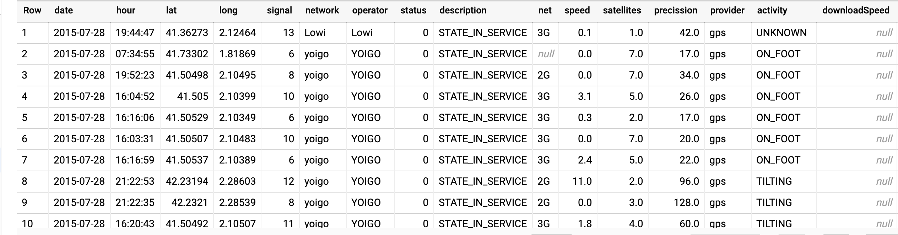
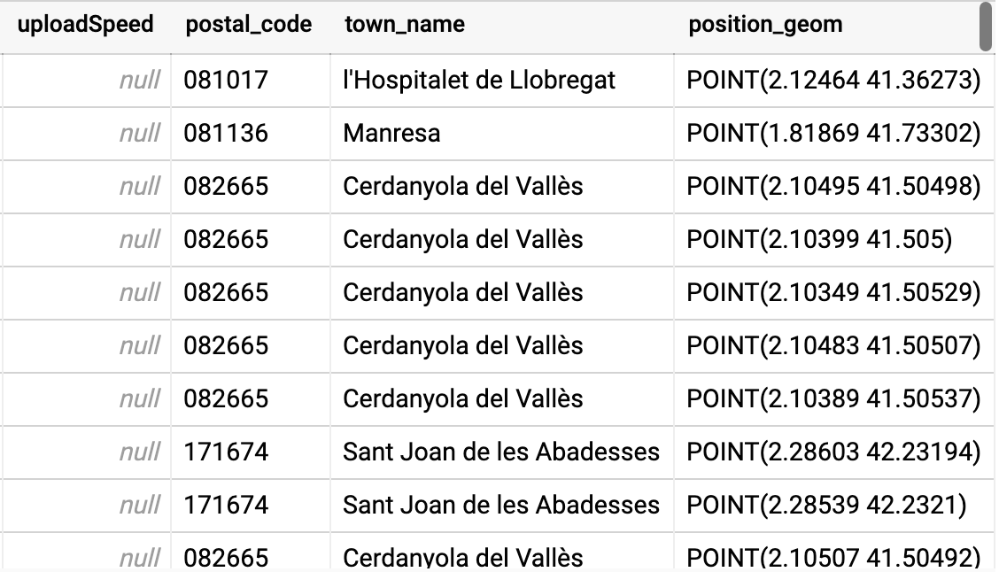

# CATALONIA CELL COVERAGE (2015 - 2017)

## Motivation

The dataset I have chosen  is the [Government of Catalonia](https://catalangovernment.eu/) released [data](https://analisi.transparenciacatalunya.cat/en/Ci-ncia-i-Tecnologia/Dades-recollides-per-l-aplicaci-Cobertura-M-bil-20/g9ma-vbt8/data) about cell coverage which shows the data regarding the service provider, operator, network, location, speed (upload and download) and many more things about any device at a particular day and time at a certain location. So, it made me wonder that i can use the data for some machine learning projects, in which i can use this data for predictions like which regions requires more towers if there are more congestions in the network, also it can be used by government to monitor any suspicious activities by frequential data about specific device. Also, the same data can be used to visualize different things like different regions and the number of population in that region using which operator and network and show some analytics about the popular networks and many more things. Data Science enthusiasts are always looking for something useful in the data so that it can useful for some visualization to show some discrepancy or to summarize different aspects about the data. I being a machine learning lover, love to use dat to predict something as it helps to get something out of data and helps with somethings which can ease the effort of doing it manually. This data helps in predicting many different things of which i have described some of them above, it only depends how we transform the data accordingly and pass it onto a machine learning model with pre-processing data earlier.

## About Data 

The Data is available as google provided [public dataset](https://console.cloud.google.com/marketplace/details/gencat/cell_coverage?project=riddler-quiz&folder&organizationId). But it can be found on the official website with recently updated data here. There are different data sets according to the region you are in, on google public dataset. To get the recent dataset, it can be downloaded from here or can accessed using the api provided by them.
The following description is from the developers only: 
**“ The GenCat Mobile Coverage app is an initiative of the Government of Catalonia to crowdsource data collection on the   state of mobile telephone network coverage in Catalonia. The platform uses an Android app to record citizens data through their mobile devices on the level of coverage per operator, network (2G, 3G and 4G) and the device's location. This dataset contains the platform data over the 2015-2017 period. This data might be used to analyze the quality of mobile coverage in Catalonia of the four main operators (Movistar, Vodafone, Orange and Yoigo) and filter data according to the technology used (2G, 3G or 4G). Additionally the data enables the identification of areas in Catalonia that need to improve their mobile coverage with the final goal of helping to improve the efficiency of basic services for the general public.”**

## Description

### Table Description Info 

### Table Schema

### Data Snapshot

## Obtaining Data And Pre-Processing 

The dataset contains unfiltered data, so it requires pre-processing before making visualizations out of it. The Data can be obtained in different ways:
1. Directly from [Google Public Dataset](https://console.cloud.google.com/marketplace/details/gencat/cell_coverage?project=riddler-quiz&folder&organizationId) .
2. It can be crawled from the [API](https://analisi.transparenciacatalunya.cat/resource/g9ma-vbt8.json).
3. It can be downloaded from [here](https://analisi.transparenciacatalunya.cat/en/Ci-ncia-i-Tecnologia/Dades-recollides-per-l-aplicaci-Cobertura-M-bil-20/g9ma-vbt8/data).
	
_The data is unprocessed and contains certain unwanted material. So, preprocessing was required on bigquery before doing the visualizations on the data. I was going to download the data and then apply preprocessing to the data and then upload the data to Google Cloud Storage. But the main problem here, was that the data was in spanish which would have been  a problem for me to run queries on big query. So, I resorted to  big query as google dataset has 2 versions which have 2 different languages, one for EU region and another for US region. So, I’m using the US version data for my project. The pre-processing done on data is to remove the null values and unknown values from the data when running queries as of now as I’m using the google public dataset i just need to keep in mind to check for null and unknown values while executing the queries before showing the analysis, otherwise analysis will have discrepancies and will not give appropriate  analysis and visualization._

## Big Query

### - How did you load your data to BigQuery?

I am already using the data stored in bigquery. But, initially i tried to to process the data and then load the data into bigquery but the data that was download needed to be translated into English, i prefered doing queries on Big-Query with dataset already on it.

### - After loading the data to BigQuery, describe what table(s) you’d have and what the schema(s) would be like. 
  
Table mobile_data_2015_2017 will be used for the analysis part and which further can be used to preprocess the data for some other useful data as per analysis. 

## Analytics

<iframe width="800" height="1000" src="https://datastudio.google.com/embed/reporting/f5b9bd2a-7e31-45cd-8cd6-cfb6d37c0099/page/5ukOB" frameborder="0" style="border:0" allowfullscreen></iframe>

### Summary

- **Top Networks in Catalonia**,**Top 9 Operators in Catolonia** talks about all top networks and operators in Catalonia fro the year 2015- 2017

- **Overall Active Users in shift** gives the active users for the shifts (_Morning_, _Afternoon_ and _Night_) for the year 2015- 2017

- **User Count for each month** helps to summarize the change in user count from the year 2015- 2017. It shows how number of users are changing with the need of networks these days and helps us to keep an eye on the rate of users taking up which networks.

- **Number of Users for each net** gives networks user for the year 2015-2017 which helps any operator to focus their aim to the customers which still are using the old networks and gets them to new to expand business.

- **Users with Activity** sumarizes the users accessing the networks doing this day and can be directly related to accidents happening on the raods, if people are using mobile phone while riding vehicles(It can be but not always but this data can be used for such analysis also who knows!)

- **Precision range for users** summarizes about the users with precision in the range present in Legend. This can be used by government to check whether how many users get services fair and square  and helps in finding out the less precision error.

- **Users status** summarizes the users status which have owned the sim card and wants to access the network.

- **Active user's  count for network for top city (High Active Users)** gives the User Count for the Top City for that shift and for that Year. It helps to identify which city has the most congession and when so that at that time some automation can be done to ease the effort.

- **Active user's count for the perticular provider for the top city(With Max number of Active Users) at that time and year** helps to summarize the which particular provider was being accessed the most and helps if finding out multiple different cheap ways to provide if certain provider takes too much load. The following shows the query results : 

## Challenges

1.Skewed Data: The data was skewed, so my goals was too transform and anlyze the data so that it will be helpful for providing insights which can be used to train machine learning models for some prediction or classification but the data was skewed which lead to think more as i cannot find a concrete evidence with such less and skewed data.

2. Data From public dataset :  I used the public dataset provided by google, there was not much flexibilty but helped to get good insights about the data and helps in finding relation between the data. It has very much less data, if data was huge it would have been used and transformed for some machine learning model and more visualization.

3.Missing field values: Data for upload speed and download speed was null, so if the was there then it would have been grate to again gain more insights about the data.

4. Data Studio issue with Drilling Down and aggregators : Looks like Google data studio is not able to handle data which is aggregated by array aggregators and also has 2 level drilling only. I have screenshots and put it there as it was not able to show in any form of charts or table.

## Future Work

1. This cell coverage data can be used by many domains to get insights about user activities and helps in determining some useful data from it.
2. If the data was enough, then more things can be done with it which includes transformation of the data for machine learning models which can be used to predict as well as classify things like prediction of revenues for operator for that region depending on the user activity and classifying regions into zones for development so government can have campaingns.
3. Catalonia data includes all things like operator, networks ,etc. It can be used by government to gain insights about networks and to set some regulations and many more things.

## Query Execution Details :
1.**Active user's count for the perticular provider for the top city(With Max number of Active Users) at that time and year** 

2.**Active user's  count for network for top city (High Active Users)**

## Why Big Query? 

There are many useful as well as optimization features which is provided by Big Query some those are below:

-BigQuery helps in doing some complex queries easily using UDF's , struct, etc.
-BigQuery helps in  calculating metrics/stats/aggregates over a large amount of data easily beacause of its orientation for storing the data.
-User-friendly Web- UI for querying and data loading.
-Easy way to integrate with Google Data Studio  as well as Google BI engine to visualize the data .

